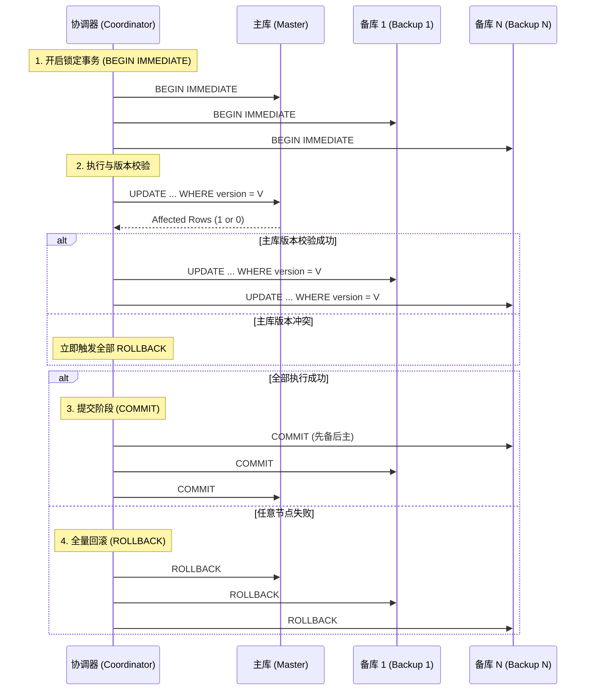

# 分布式事务服务设计文档 - SQLite 主备原子同步方案

## 1. 业务背景
在使用 SQLite 等轻量级嵌入式数据库时，缺乏原生的分布式一致性保障。本方案旨在实现一个“一主多备”的同步双写机制，确保在大量写入场景下，所有数据库节点的提交要么全成功，要么全回滚，并支持通过版本号进行并发控制。

## 2. 核心架构设计

### 2.1 架构原则
- **高内聚低耦合**：将事务协调逻辑封装在独立的服务/模块中。
- **强一致性**：采用同步双写（2PC 变体）确保主备数据物理级一致。
- **可维护性优先**：利用 Rust 的 RAII 机制简化回滚逻辑。

### 2.2 逻辑流程
系统采用“协调器（Coordinator）”模式，管理 1 个主库（Master）和 N 个备库（Backup）。



## 3. 数据模型设计

### 3.1 乐观锁设计
所有需要保持同步的表必须包含 `version` 字段。

```sql
CREATE TABLE business_data (
    id TEXT PRIMARY KEY,
    content TEXT,
    version INTEGER NOT NULL DEFAULT 1,
    updated_at DATETIME DEFAULT CURRENT_TIMESTAMP
);
```

### 3.2 更新协议
更新操作必须遵循以下 SQL 模式：
```sql
UPDATE business_data 
SET content = ?, version = version + 1 
WHERE id = ? AND version = ?;
```

## 4. 关键特性实现

### 4.1 一主多备管理
- **连接池**：维护一个指向 Master 和所有 Backup 的连接集合。
- **并行执行（可选）**：在执行阶段，可以并行向所有备库发送写入请求以提高性能。
- **拓扑结构**：配置中定义 `master_path` 和 `backup_paths: Vec<String>`。

### 4.2 异常恢复与原子性
- **RAII 回滚**：在 Rust 实现中，利用 `Transaction` 对象的 `Drop` 实现。如果函数在 `commit()` 前返回（如报错、宕机重启），未提交的事务会自动回滚。
- **提交顺序**：**先提交所有备库，最后提交主库**。
    - 如果备库提交时失败，主库尚未提交，可以安全回滚。
    - 如果主库提交失败（极低概率），则备库已提交，此时系统进入“待对齐”状态，可通过日志进行补偿。

## 5. 数据源管理与一致性保障

### 5.1 数据源集群化 (Clustering)
数据源管理不直接操作物理路径，而是通过 `Cluster` 对象进行封装。每个集群由 1 个 Master 和 N 个 Backup 组成，并在初始化时进行逻辑绑定。

### 5.2 注册与发现机制
- **集群元数据表 (`_cluster_meta`)**：在每个数据库初始化时自动创建。
    ```sql
    CREATE TABLE _cluster_meta (
        cluster_id TEXT NOT NULL,
        node_id TEXT PRIMARY KEY,
        role TEXT CHECK(role IN ('MASTER', 'BACKUP')),
        paired_at DATETIME DEFAULT CURRENT_TIMESTAMP
    );
    ```
- **配对校验**：协调器在连接数据库后，首先读取 `_cluster_meta`。如果 `cluster_id` 不统一，或者存在多个 `MASTER`，协调器将拒绝启动。

### 5.3 录入一致性流程
当新增加一个备库节点时，必须执行“克隆-绑定”流程：
1. **全量克隆**：从主库进行物理备份（或导出 SQL）创建新备库。
2. **写入绑定信息**：在新备库中写入与主库一致的 `cluster_id`。
3. **热加载**：协调器通过热加载接口识别新节点，并执行一次 `BEGIN IMMEDIATE` 锁住全集群进行验证。

### 5.4 数据源接入步骤（StorageEngine）
新增数据源需要遵循统一接口规范，确保主备一致性流程可复用：

1. **实现接口**：新增一个 `StorageEngine` 实现，提供以下方法：
   - `execute`：执行普通 SQL（DDL/简单查询）
   - `prepare/commit/rollback`：两阶段提交的本地事务阶段
   - `get_version`：读取版本号（用于一致性校验）
   - `check_health`：健康检查
2. **服务端注册**：在 `server.rs` 的引擎选择逻辑中注册新引擎。
3. **主备一致性约束**：
   - 业务表必须包含 `version` 字段。
   - 更新必须使用“条件更新”模式（见第 3.2 节）。
4. **验证流程**：使用验证脚本启动集群，执行客户端写入与一致性校验。

## 6. 高可用 (HA) 与存活机制

### 6.1 心跳与存活监测 (Heartbeat)
协调器内部维护一个后台任务，定期（如每 5 秒）对所有数据源执行轻量级探测：
- **探测方式**：执行 `SELECT 1` 或读取 `_cluster_meta`。
- **状态流转**：
    - `HEALTHY`：响应正常。
    - `SUSPECT`：单次响应超时，进入观察期。
    - `DOWN`：连续 N 次失败，正式剔除出可用列表。

### 6.2 选主与故障转移 (Failover)
当主库（Master）被判定为 `DOWN` 时，触发自动选主逻辑：
1. **备库对齐校验**：协调器对比所有 `HEALTHY` 状态备库的最新事务 ID 或版本号。
2. **晋升逻辑**：选择版本号最高、数据最全的备库，发送 `UPDATE _cluster_meta SET role = 'MASTER'` 指令。
3. **拓扑更新**：更新协调器的内存路由表，将原备库连接提升为主库连接。

### 6.3 脑裂预防 (Split-Brain Prevention)
为了防止在网络分区时出现多个主库，采用以下策略：
- **法定人数机制 (Quorum)**：只有当超过半数（N/2 + 1）的节点认为某个节点是主库时，该主库才接受写操作。
- **外部锁/仲裁 (External Arbiter)**：在轻量级场景下，可利用一个共享的外部文件或 Redis 键作为“主库令牌（Master Token）”。只有持有令牌的节点才能被视为真正的 Master。
- **隔离 (Fencing)**：一旦发生主从切换，原主库上线后必须先以 `READ_ONLY` 模式启动，并执行数据对齐，由协调器验证后方可恢复。

## 7. 待办事项 (TODO)
- [ ] 初始化 Rust 项目结构
- [ ] 实现 `MultiDbCoordinator` 核心代码
- [ ] 编写并发冲突测试用例
- [ ] 增加主备数据自动对齐工具
