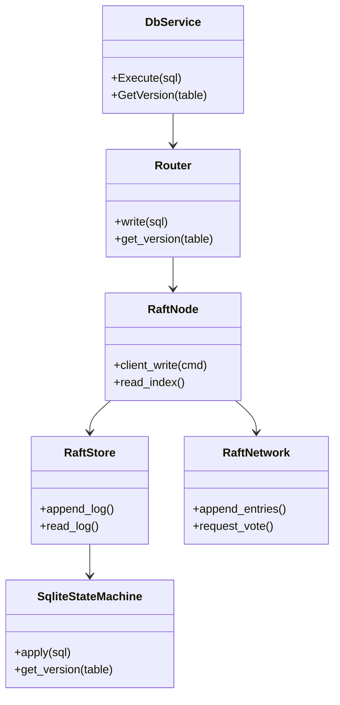
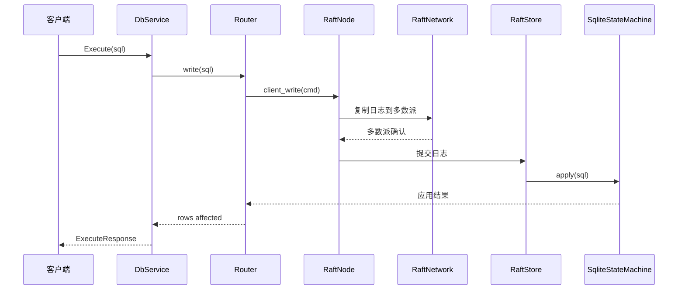

# 分布式事务服务设计文档 - Raft + SQLite 架构

## 修改记录 (2026-02-18)
- **原因**：文档仍描述 2PC 主备方案，与当前 Raft 架构不一致。
- **目的**：补充 Raft 架构说明、使用方式、必备说明，并加入类图与时序图。
- **时间**：2026-02-18

## 1. 背景与目标
为了解决多节点 SQLite 的一致性与容错问题，系统内部已替换为 Raft 驱动写入路径。Raft 负责日志复制与提交，SQLite 作为状态机承载业务数据，sled 负责持久化 Raft 日志与元数据。

## 2. 核心组件
- **Router**：服务端写入入口，统一路由写/读请求。
- **RaftNode**：封装 Raft 核心，负责 client_write 与读一致性入口。
- **RaftStore**：基于 sled 持久化 Raft 日志与元数据。
- **SqliteStateMachine**：应用已提交日志到 SQLite。
- **RaftNetwork**：Raft 节点间 RPC 适配层。
- **gRPC Service**：对外暴露 DatabaseService 接口。

## 3. 类图


## 4. 写入时序图


## 5. 读路径说明
- **线性一致读**：优先通过 leader 的读一致性机制（如 read_index）保证读与最新提交一致。
- **无 Leader 场景**：读请求会失败并返回错误，避免不一致的隐式降级。

## 6. 使用说明
### 6.1 Server CLI
- `--port <u16>`：服务监听端口。
- `--db <path>`：SQLite 数据文件路径。
- `--engine <name>`：存储引擎（默认 `sqlite`）。

### 6.2 Client CLI
- `--scenario <full|verify-only>`：执行完整流程或仅一致性校验。
- `--mode <quorum|strong>`：一致性模式（客户端侧协调逻辑）。
- `--pause-before-commit-ms <ms>`：在 prepare/commit 间注入停顿。
- `--master-addr <url>`：主节点地址。
- `--slave-addrs <url1,url2>`：备节点地址（逗号分隔）。

### 6.3 验证脚本
```powershell
./verify.ps1 -Scenario full
./verify.ps1 -Scenario restart_single_node
./verify.ps1 -Scenario prepare_commit_kill
```

## 7. 必备说明
- **表结构约束**：业务表必须包含 `version` 字段。
- **端口与文件**：确保端口空闲，SQLite 文件会自动创建。
- **故障注入**：使用 `--pause-before-commit-ms` 控制故障窗口。
- **Leader 依赖**：无 Leader 时写入失败，需等待选主完成。
