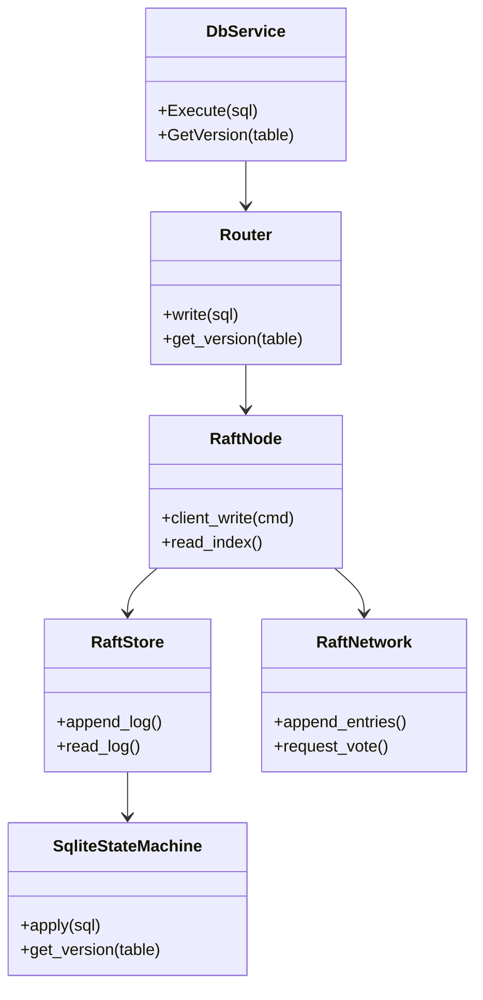
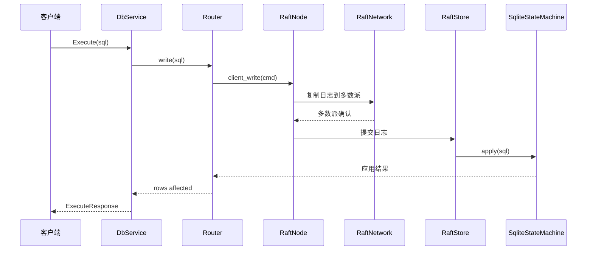

# 分布式事务服务设计文档 - Raft + SQLite 架构

## 修改记录 (2026-02-18)
- **原因**：文档仍描述 2PC 主备方案，与当前 Raft 架构不一致。
- **目的**：补充 Raft 架构说明、使用方式、必备说明，并加入类图与时序图。
- **时间**：2026-02-18

## 1. 背景与目标
为了解决多节点 SQLite 的一致性与容错问题，系统内部已替换为 Raft 驱动写入路径。Raft 负责日志复制与提交，SQLite 作为状态机承载业务数据，sled 负责持久化 Raft 日志与元数据。

> **注意**：当前 Raft 核心逻辑已基于 OpenRaft 实现，但节点间通信暂使用内存通道（RaftRouter）模拟，gRPC 仅用于客户端与服务端的通信，ReadIndex 线性一致读尚未暴露给 Router。

## 2. 核心组件
- **Router**：服务端写入入口，统一路由写/读请求。
- **RaftNode**：封装 OpenRaft 核心，负责 client_write。
- **RaftStore**：基于 sled 持久化 Raft 日志与元数据。
- **SqliteStateMachine**：应用已提交日志到 SQLite。
- **RaftNetwork**：Raft 节点间通信适配层（当前为内存模拟 RaftRouter）。
- **gRPC Service**：对外暴露 DatabaseService 接口。

## 3. 类图


## 4. 写入时序图


## 5. 读路径说明
- **当前状态**：读请求直接查询本地 SQLite 状态机。
- **计划中**：
  - **线性一致读**：将通过 Leader 的 ReadIndex 机制保证读与最新提交一致。
  - **无 Leader 场景**：读请求应失败或转发。

## 7. AIoT 架构演进与差距分析
基于最新的 "云-端-边 AIoT" 架构愿景，当前代码实现仍存在以下差距，需在后续迭代中补齐：

### 7.1 基础设施层 (Infrastructure)
- **Raft 网络通信**：当前使用内存通道 (`RaftRouter`) 模拟，需迁移至基于 gRPC/Protobuf 的真实网络层，以支持多机部署。
- **线性一致读 (ReadIndex)**：需在 `Router` 层暴露 `read_index` 接口，确保从 Follower 读取数据时的一致性，而非直接读取本地状态机。

### 7.2 AI 决策核心 (AI Decision Core)
- **TinyLLM 集成**：Hub 端目前仅有存储能力，缺失 AI 推理运行时（如 `candle` 或 `ort`）及模型加载机制。
- **决策引擎 (DecisionMaker)**：缺失规则引擎与 AI 决策模块的胶水层，无法根据 Raft 状态机中的数据变化自动触发控制指令。

### 7.3 端-边协同 (Hub-Edge Synergy)
- **控制协议**：缺失 Hub -> Edge 的标准化指令下发通道（Protobuf 定义）。
- **数据上报**：缺失 Edge -> Hub 的感知数据上报管道与缓冲机制。powershell
./verify.ps1 -Scenario full
./verify.ps1 -Scenario restart_single_node
./verify.ps1 -Scenario prepare_commit_kill
```

## 7. 必备说明
- **一致性依据**：使用内部写入序号，不要求业务表包含 `version` 字段。
- **端口与文件**：确保端口空闲，SQLite 文件会自动创建。
- **故障注入**：使用 `--pause-before-commit-ms` 控制故障窗口。
- **Leader 依赖**：无 Leader 时写入失败，需等待选主完成。
