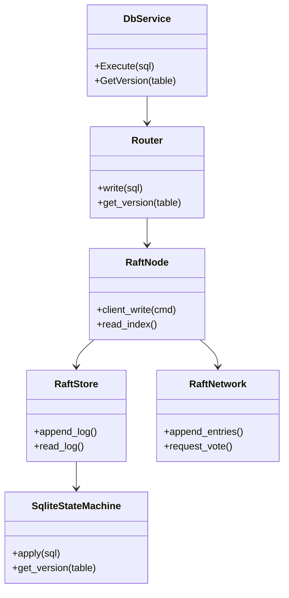
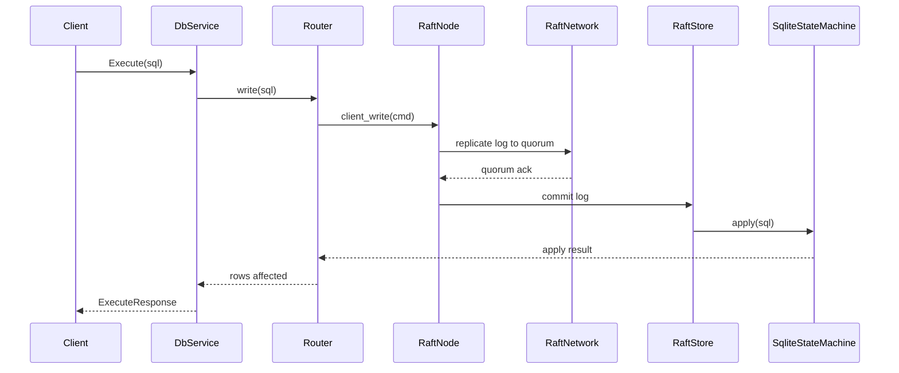

# Distributed Transaction Service Design - Raft + SQLite Architecture

## Change Log (2026-02-18)
- **Reason**: Provide an English architecture document aligned with the current Raft implementation.
- **Goal**: Describe components, read/write paths, diagrams, and operational notes.
- **Time**: 2026-02-18

## 1. Background and Goals
To achieve strong consistency and fault tolerance across multiple SQLite nodes, the internal write path is driven by Raft. Raft handles log replication and commit, SQLite is the state machine for business data, and sled persists Raft metadata and logs.

## 2. Core Components
- **Router**: Server-side entry for write/read requests.
- **RaftNode**: Wraps the Raft core and orchestrates replication.
- **RaftStore**: Persists Raft logs and metadata using sled.
- **SqliteStateMachine**: Applies committed SQL to SQLite.
- **RaftNetwork**: RPC adapter for Raft peer communication.
- **gRPC Service**: Exposes DatabaseService to clients.

## 3. Class Diagram


## 4. Write Path Sequence


## 5. Read Path Notes
- **Linearizable read**: Prefer leader read-index (when available) to ensure read-after-write consistency.
- **No leader**: Reads fail with an error to avoid unsafe fallback.

## 6. Usage
### 6.1 Server CLI
- `--port <u16>`: gRPC listen port.
- `--db <path>`: SQLite database file path.
- `--engine <name>`: Storage engine (default: `sqlite`).

### 6.2 Client CLI
- `--scenario <full|verify-only>`: Full flow or verify-only.
- `--mode <quorum|strong>`: Consistency mode for client coordination.
- `--pause-before-commit-ms <ms>`: Pause window between prepare/commit.
- `--master-addr <url>`: Master node address.
- `--slave-addrs <url1,url2>`: Comma-separated follower addresses.

### 6.3 Verification Script
```powershell
./verify.ps1 -Scenario full
./verify.ps1 -Scenario restart_single_node
./verify.ps1 -Scenario prepare_commit_kill
```

## 7. Required Notes
- **Schema constraint**: Business tables must include a `version` column.
- **Ports and files**: Ensure ports are available; SQLite files are created on demand.
- **Fault injection**: Use `--pause-before-commit-ms` to open the failure window.
- **Leader dependency**: Writes fail without an elected leader.
