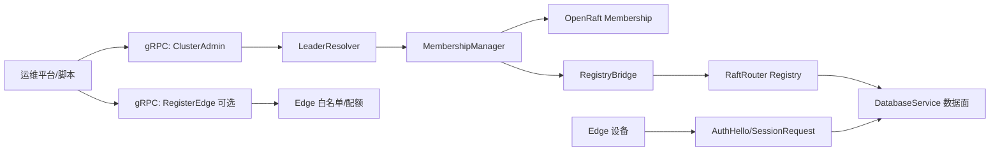

# Hub / Edge 动态注册架构设计稿（v1）

## 修改记录（2026-03-06）
- 修改原因：当前系统缺少运行时动态扩缩容入口，Hub 节点加入/移除依赖手工流程，不利于平台化运维。
- 修改目的：给出可落地的控制面架构方案、接口边界与分阶段实施路径，作为后续实现与评审基线。

## 1. 背景与问题

当前仓库已具备：
- 数据面 gRPC：`DatabaseService`（Execute/Prepare/Commit/...）
- 管理面 gRPC：`OrderRulesAdmin`（规则热更新）
- 边缘接入：Edge 通过 TCP + `AuthHello` 建立会话并上报数据

当前缺口：
- 没有 `AddHub/RemoveHub/ListHubs` 一类集群管理 API。
- `server` 启动流程仍是静态节点启动，非运行时动态注册。
- OpenRaft 成员变更能力仅在测试中演示，未封装到生产控制面。

## 2. 设计目标

- 提供可编排的 Hub 动态注册能力（新增/移除/查询/健康）。
- 兼容当前架构，尽量复用现有 gRPC 技术栈与部署方式。
- 保障一致性安全边界：成员变更不破坏 quorum。
- 预留 Edge 管控面注册能力（白名单/配额），与运行面握手解耦。

## 3. 非目标（v1 不做）

- 不引入新服务发现系统（如 etcd/consul）。
- 不重构 Edge 运行面协议（仍保留 `AuthHello` + SessionRequest）。
- 不在本稿实现代码，仅输出可执行设计。

## 4. 方案对比

### 方案 A：在现有 gRPC 中新增 `ClusterAdmin`（推荐）

优点：
- 复用现有 protobuf/tonic/部署链路，改造成本低。
- API 权限、审计、可观测性可统一管理。
- 与当前 `server` 结构最贴合，落地速度快。

缺点：
- 控制面与数据面同进程，极端高压下存在资源竞争。

### 方案 B：独立 Control Plane 服务

优点：
- 职责和故障域隔离更好，演进空间大。

缺点：
- 引入额外部署复杂度，需要额外路由与安全治理。
- 对当前项目阶段改造跨度较大。

### 方案 C：仅保留脚本/CLI 管理

优点：
- 实现最快。

缺点：
- 不可平台化，不利于自动化编排与统一审计。

## 5. 推荐架构（方案 A）

### 5.1 逻辑组件

- `ClusterAdminService`：集群控制面入口（新增 Hub/移除 Hub/查询拓扑/集群健康）。
- `LeaderResolver`：统一 leader 判定与重定向策略。
- `MembershipManager`：封装 OpenRaft 成员变更序列（add_learner -> change_membership）。
- `RegistryBridge`：将新节点注册到 `RaftRouter`（进程内网络寻址）。
- `EdgeRegistry`（可选）：Edge 预注册（白名单、配额、元数据）。

### 5.2 数据面与控制面关系



## 6. API 草案（proto 层）

```proto
service ClusterAdmin {
  rpc AddHub(AddHubRequest) returns (AddHubResponse);
  rpc RemoveHub(RemoveHubRequest) returns (RemoveHubResponse);
  rpc ListHubs(ListHubsRequest) returns (ListHubsResponse);
  rpc ClusterHealth(ClusterHealthRequest) returns (ClusterHealthResponse);
}

message AddHubRequest {
  uint64 node_id = 1;
  string raft_addr = 2;
  string grpc_addr = 3;
  bool auto_promote = 4;
  string request_id = 5; // 幂等键
}

message AddHubResponse {
  uint64 membership_version = 1;
  string leader_hint = 2;
}
```

说明：
- `request_id` 用于幂等，避免重试导致重复加点。
- 非 leader 节点接收管理请求时返回 `leader_hint` 做重定向。

## 7. 函数级调用链（推荐）

### 7.1 AddHub

1. `ClusterAdminService::add_hub(req)`
2. `LeaderResolver::ensure_leader_or_redirect()`
3. `MembershipManager::precheck_add(req.node_id, req.grpc_addr)`
4. `RaftNode::add_learner(node_id, basic_node)`
5. `RaftNode::change_membership(voters')`（当 `auto_promote=true`）
6. `RegistryBridge::register(node_id, target)`
7. 返回 `membership_version`

### 7.2 RemoveHub

1. `ClusterAdminService::remove_hub(req)`
2. `LeaderResolver::ensure_leader_or_redirect()`
3. `MembershipManager::precheck_remove(node_id)`（含 quorum 风险检查）
4. `RaftNode::change_membership(voters_without_node)`
5. `RegistryBridge::unregister(node_id)`
6. 返回 `membership_version`

### 7.3 RegisterEdge（可选）

1. `ClusterAdminService::register_edge(req)`（仅白名单元数据）
2. Edge 实际连入仍走 `AuthHello`
3. `AuthHello` 时读取白名单策略进行准入判定

## 8. Hub 节点数约束（必须明确）

- 是否必须奇数：**不是强制**，但**强烈推荐奇数**（3/5/7）。
- 最小可运行节点数：**1**（仅可用，不具备高可用）。
- 最小高可用节点数：**3**（可容忍 1 节点故障）。
- 运维建议：
  - 生产默认 3 或 5。
  - 避免长期偶数拓扑（4/6）作为常态规模。

## 9. 一致性与安全边界

- 非 leader 管理请求统一重定向，不在 follower 执行成员变更。
- 删除节点前必须进行 quorum 校验，不满足则拒绝。
- 成员变更全过程记录审计日志（操作者、请求 ID、前后 membership）。
- 管理接口建议加鉴权与限流（mTLS + token + rate limit）。

## 10. 分阶段落地计划

### Phase 1（最小可用）
- 交付：`AddHub/ListHubs/ClusterHealth`
- 行为：仅支持加入 learner，不自动 promote。

### Phase 2（可生产）
- 交付：`RemoveHub` + `auto_promote` + 幂等存储 + 审计事件。

### Phase 3（增强）
- 交付：控制面独立化、RBAC、多租户策略、全链路追踪。

## 11. 风险与测试建议

潜在问题：
- 变更窗口与故障切换叠加，可能导致短时不可写。
- 重试请求若无幂等键，可能重复加入同一节点。
- 删除节点策略不当，可能降低容错能力。

建议测试用例：
- `add_hub_idempotent_with_same_request_id`
- `add_hub_reject_on_follower_with_leader_hint`
- `remove_hub_reject_when_quorum_at_risk`
- `add_hub_then_failover_then_write_still_ok`
- `remove_hub_then_cluster_health_consistent`

## 12. 兼容性评审与版本策略（SQLite / sled）

### 12.1 目标与范围

- 目标：确保新 Hub 节点加入时，不因本地 SQLite/sled 格式差异破坏集群一致性。
- 范围：仅覆盖 Hub 侧持久化兼容，不覆盖 Edge 业务数据模型演进。

### 12.2 版本模型（统一上报）

新增节点在 `AddHub` 前必须上报以下版本信息：
- `app_semver`：服务二进制版本（例如 `1.4.2`）。
- `sqlite_schema_version`：SQLite 业务与元数据 schema 版本。
- `sled_format_version`：RaftStore/NoncePersistence 的 sled 数据格式版本。
- `log_codec_version`：Raft 日志序列化编码版本（用于跨版本读写判定）。

建议扩展 AddHub 请求：

```proto
message NodeCompatibility {
  string app_semver = 1;
  uint32 sqlite_schema_version = 2;
  uint32 sled_format_version = 3;
  uint32 log_codec_version = 4;
}
```

### 12.3 准入规则（v1 推荐：严格相等）

- `sqlite_schema_version` 必须与当前 leader 相等。
- `sled_format_version` 必须与当前 leader 相等。
- `log_codec_version` 必须与当前 leader 相等。
- `app_semver` 至少满足同 major/minor（建议初期直接全相等）。

不满足时拒绝加入，返回结构化错误：
- `INCOMPATIBLE_SQLITE_SCHEMA`
- `INCOMPATIBLE_SLED_FORMAT`
- `INCOMPATIBLE_LOG_CODEC`
- `INCOMPATIBLE_APP_VERSION`

### 12.4 SQLite 兼容策略

- 强制维护 `sqlite_schema_version`，版本落地建议：
  - `PRAGMA user_version` 保存主 schema 版本。
  - `_raft_meta` 增加 `schema_version` 冗余键用于排查与审计。
- 采用“有序迁移链”：
  - `migrate_sqlite(from, to)` 逐版本执行，不允许跨级跳跃。
  - 迁移失败时禁止启动为可加入状态。
- 回滚策略：
  - 仅允许“前向迁移 + 快照回退”，不允许在线 DDL 反向回滚。

### 12.5 sled 兼容策略

- RaftStore 与 NoncePersistence 分别维护格式版本键：
  - `raft_meta:format_version`
  - `nonce_db:format_version`
- 启动时先执行 `validate_sled_format()`，不匹配立即失败并给出迁移指引。
- 不兼容迁移采用“新目录重建 + 数据导入”模式，避免原地破坏。

### 12.6 动态注册流程中的兼容关口

1. `ClusterAdminService::add_hub(req)` 接收兼容信息。
2. `CompatibilityChecker::check(req.compatibility, leader_baseline)`。
3. 校验通过后才进入 `add_learner -> change_membership`。
4. 校验失败直接返回错误码和建议动作（升级、迁移或重建）。

### 12.7 运行与升级策略

- 滚动升级顺序建议：Follower/Learner -> Leader（最后）。
- 在混部窗口内，禁止触发 schema 升级型 DDL。
- 升级窗口内优先关闭自动 promote，先以 learner 观测稳定性。

### 12.8 兼容性测试基线

- `add_hub_reject_when_sqlite_schema_mismatch`
- `add_hub_reject_when_sled_format_mismatch`
- `add_hub_reject_when_log_codec_mismatch`
- `add_hub_accept_when_all_versions_match`
- `rolling_upgrade_minor_version_without_membership_change`
- `join_after_sqlite_migration_success`

---

本稿用于架构评审基线，后续实现以本稿 API 边界和调用链为准，允许在不破坏兼容性的前提下做字段扩展。
