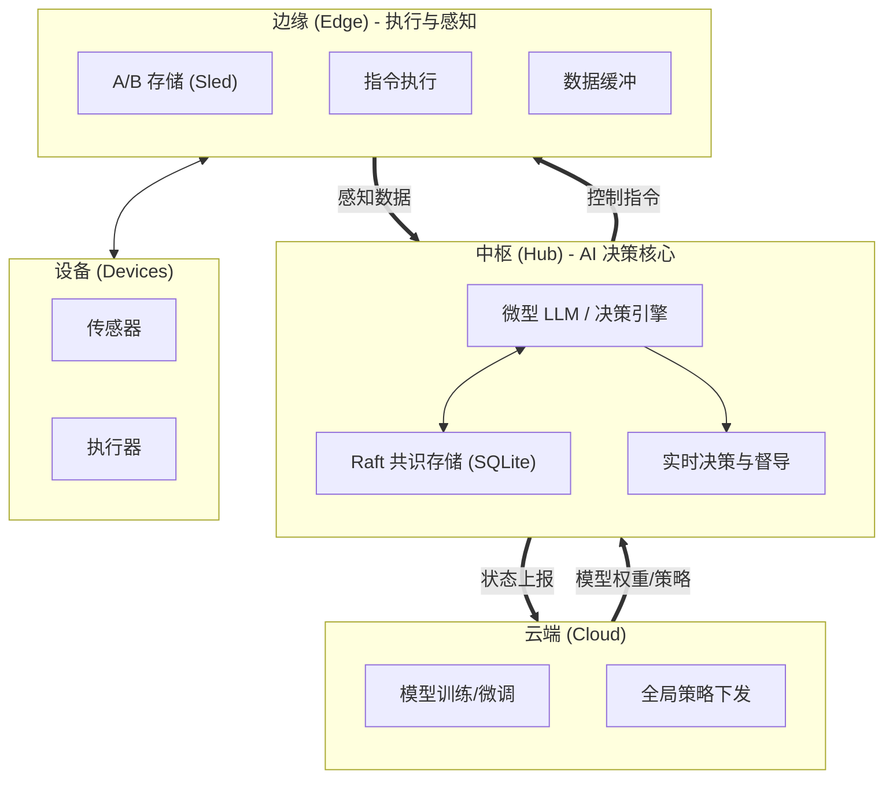
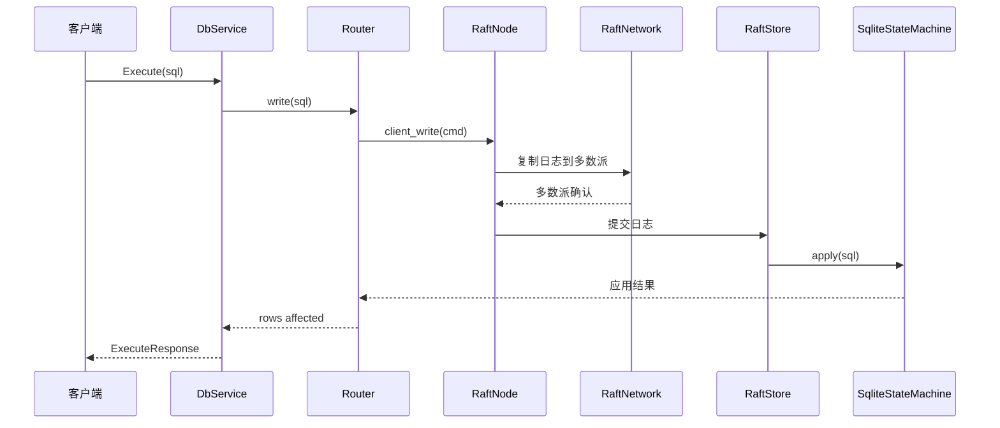
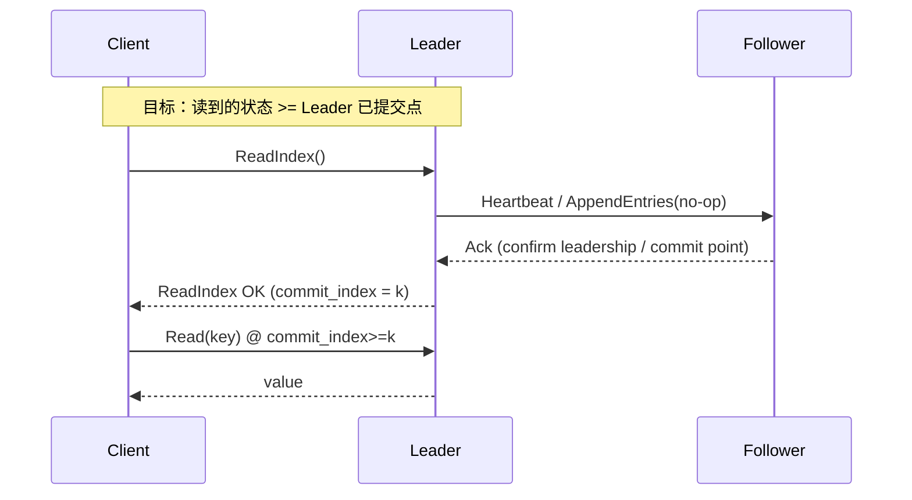
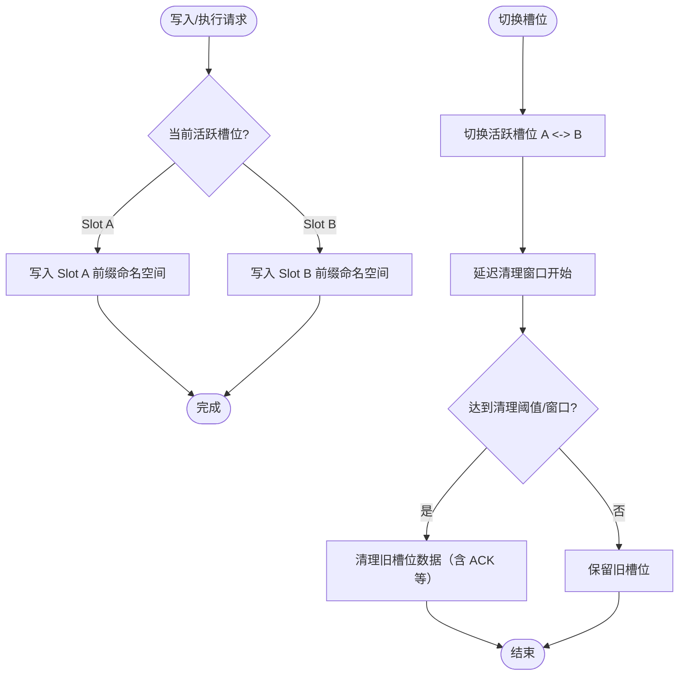
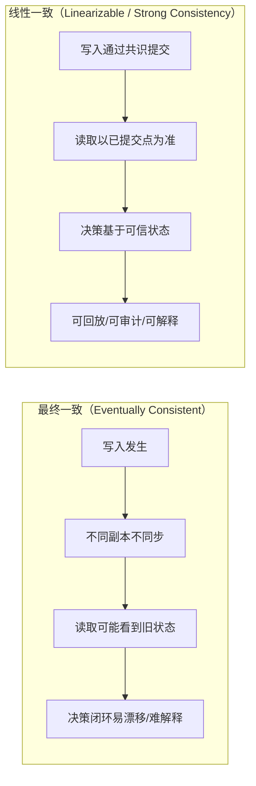

# X 平台晚间连载推广文案（AI4IoT 数据底座 / Raft-backed SQLite）

> 更新时间：2026-03-03  
> 适用：个人开发者、诚恳口吻、强调全程 AI 辅助开发；每晚发 1 组（中文线程 + 英文线程分开两条）。

## 使用方式

- 每晚先发 **中文线程**（4–6 条），间隔 5–10 分钟发 **英文线程**（4–6 条）。
- 每条只讲 1 个点：痛点/结论 → 机制 → 证据 → 共建 CTA。
- 发布前仅需替换占位符：
  - `<REPO_LINK>`：仓库链接
  - `<ISSUE_LINK>`：招募/任务 issue（可选，没有就删掉这一段）
- 配图建议：优先使用本文档的 Mermaid 模板，在 GitHub 渲染后截图或直接贴链接。

## 配图（Mermaid 模板）

### 图 A：Cloud–Hub–Edge–Devices（AIoT 嵌入式数据底座）

### 图 B：写路径（Raft log → commit → apply）

### 图 C：线性一致读（ReadIndex）示意

### 图 D：Edge A/B 槽位切换 + 延迟清理（高层行为）

### 图 E：一致性直觉图（Eventually vs Linearizable）

---

## 14 天内容（中文线程 + 英文线程）

### Day 1：开场定位（AI4IoT 闭环的数据底座）

**中文（线程 5 条）**
1/ AI4IoT 真正难的不是“能跑模型”，而是闭环：感知→决策→执行→回执。没有可靠的状态底座，线上就会漂。  
2/ 我在 Rust 做一个开源项目：Raft-backed SQLite 分布式集群，把“决策需要的状态”做成强一致、可回放、可审计。  
3/ 写入走 Raft 日志复制，多数派提交后应用到 SQLite 状态机；Raft 元数据/日志用 sled 持久化；对外是稳定的 gRPC API。  
4/ 这是我作为个人开发者在做的，整个过程大量使用 AI 辅助（设计、测试、排错、文档），但关键取舍我会写清楚原因。  
5/ 想一起共建：一致性读（ReadIndex）、真实分布式网络、向量/时序适配、决策闭环。Repo：<REPO_LINK>  

配图建议：图 A 或图 B。

**English (5 tweets)**  
1/ AI4IoT isn’t just “running a model”. The hard part is the loop: sense → decide → act → ack. Without a reliable state foundation, things drift in production.  
2/ I’m building an open-source project in Rust: a Raft-backed SQLite distributed cluster — a durable, auditable, strongly-consistent state store for decision loops.  
3/ Writes go through Raft log replication; once committed by quorum, entries are applied to a SQLite state machine. Raft metadata/logs persist via sled. Stable gRPC API on top.  
4/ This is a solo dev project. I use AI heavily for design/testing/debugging/docs, and I’ll be transparent about the engineering trade-offs.  
5/ Looking for co-builders: linearizable reads (ReadIndex), real networking, vector/time-series adaptation, decision loop integration. Repo: <REPO_LINK>  

---

### Day 2：为什么“强一致状态”对决策闭环必要

**中文（线程 5 条）**
1/ 决策闭环里最危险的不是延迟，而是“状态不一致”：你以为设备在 A 状态，实际已变成 B。  
2/ 这会导致策略误触发、重复执行、不可解释的抖动，最后你只能加更多补丁让系统更复杂。  
3/ 所以我选了 Raft：写入必须被多数派承认，才进入“可被决策依赖”的状态。  
4/ SQLite 状态机的意义：把状态落到可查询、可审计、可回放的结构里，而不是散落在内存/日志里。  
5/ 如果你也在做端边闭环，欢迎聊真实场景/共建测试：<REPO_LINK>  

配图建议：图 E。

**English (5 tweets)**  
1/ In decision loops, latency hurts — but inconsistency kills. Believing the system is in state A when it’s actually in B is a silent disaster.  
2/ You get misfires, duplicated actions, jitter, and “unexplainable” behavior that leads to patch-on-patch complexity.  
3/ That’s why I picked Raft: a write becomes decision-grade only after quorum commit.  
4/ The SQLite state machine makes the state queryable/auditable/replayable — not scattered across memory and logs.  
5/ If you’re building edge decision loops, I’d love to learn your real-world constraints and co-build tests: <REPO_LINK>  

---

### Day 3：写路径拆解（Raft log → commit → apply）

**中文（线程 6 条）**
1/ 今天拆一下我项目的写路径（最核心、也最容易写错的部分）。  
2/ 客户端发 Execute(sql) → 服务端 Router 接入 → RaftNode 接管写入。  
3/ RaftNode 把命令封装为日志条目，复制给 Follower，等待多数派 ACK。  
4/ 达到 quorum 后提交（commit），再由状态机把 SQL 应用到 SQLite。  
5/ 这条链路的目标：你读到的状态，一定来自“已被多数派认可”的历史。  
6/ 我会把每个关键边界都用可复现的测试/脚本覆盖，欢迎一起补齐：<REPO_LINK>  

配图建议：图 B。

**English (6 tweets)**  
1/ Quick breakdown of the write path (the most important and easiest-to-break part).  
2/ Client sends Execute(sql) → Router receives → RaftNode takes over.  
3/ RaftNode wraps the command into a log entry and replicates to followers.  
4/ Once quorum acks, the entry is committed, then applied by the SQLite state machine.  
5/ Goal: state you read is always backed by “quorum-approved history”.  
6/ I’m turning each boundary into reproducible tests/scripts. Co-builders welcome: <REPO_LINK>  

---

### Day 4：线性一致读（ReadIndex）为什么值得做

**中文（线程 5 条）**
1/ 写入强一致只是第一步，读取如果不严格，你的决策还是可能基于旧状态。  
2/ 我计划补齐 ReadIndex：确保读到的是 leader 已确认的最新提交点。  
3/ 这样 Hub 的决策引擎（Tiny LLM/规则）才有资格说“我看到的状态可信”。  
4/ 这块很适合共建：协议、超时、降级策略、以及大规模下的行为。  
5/ 想一起做 ReadIndex 的同学，直接来 repo 开 issue/PR：<REPO_LINK> <ISSUE_LINK>  

配图建议：图 C。

**English (5 tweets)**  
1/ Strongly-consistent writes are step 1. Reads matter too — stale reads can still break decision loops.  
2/ I’m working on ReadIndex to make reads linearizable: read only after the leader confirms the latest committed point.  
3/ That’s what makes the Hub decision engine (tiny LLM/rules) able to trust its state.  
4/ Great co-building area: protocols, timeouts, fallback/degrade behavior at scale.  
5/ If you want to help implement ReadIndex, jump in: <REPO_LINK> <ISSUE_LINK>  

---

### Day 5：为什么用 SQLite 作为状态机（而不是纯 KV）

**中文（线程 5 条）**
1/ 我没把它做成“又一个 KV”，而是选择 SQLite 作为状态机。  
2/ 原因很朴素：IoT 状态天然是结构化的，需要查询、聚合、审计、回放。  
3/ SQL 让你更容易把“策略依赖的条件”表达清楚，也方便后续做可解释性。  
4/ 代价也明确：状态机应用必须稳定、幂等/可恢复、对失败路径更敏感。  
5/ 我会持续把这些代价写成测试与验证脚本，欢迎指出遗漏：<REPO_LINK>  

**English (5 tweets)**  
1/ I didn’t want to build “yet another KV store”. I picked SQLite as the state machine.  
2/ IoT state is structured: you need queries, aggregations, audits, and replay.  
3/ SQL also makes policy conditions explicit and helps with explainability later.  
4/ The cost is real: state-machine application must be stable, recoverable, and careful on failure paths.  
5/ I’m capturing those costs as tests and verification scripts. Feedback welcome: <REPO_LINK>  

---

### Day 6：Edge 侧为什么需要 A/B 槽位（可回滚/可清理）

**中文（线程 6 条）**
1/ Edge 侧我在做 A/B 槽位切换：不是“花活”，是为了可回滚与可控清理。  
2/ 一个槽位代表一个“可工作的版本/数据域”，切换时不必在原地覆盖。  
3/ 延迟清理能避免切换瞬间把仍在使用的数据删掉。  
4/ 槽位前缀隔离能降低交叉污染，尤其是有 ACK/对账这种状态时。  
5/ 这类机制最后都要靠测试说话：切换、清理、覆盖、异常输入。  
6/ 我把它做成可验证的行为，而不是口头承诺。Repo：<REPO_LINK>  

配图建议：图 D。

**English (6 tweets)**  
1/ On the Edge side, I’m implementing A/B slot switching. Not a gimmick — it’s about rollback safety and controlled cleanup.  
2/ A slot represents a “working version/data domain”. Switching doesn’t require in-place overwrites.  
3/ Delayed cleanup avoids deleting data still in use during transitions.  
4/ Slot-scoped prefixing reduces cross-contamination — especially with ack/reconciliation states.  
5/ This must be proven by tests: switching, cleanup, overwrites, invalid inputs.  
6/ I’m making it verifiable behavior, not promises. Repo: <REPO_LINK>  

---

### Day 7：个人开发者 + AI 开发（诚恳版“方法论”）

**中文（线程 5 条）**
1/ 说实话：我不是公司团队，这是我个人在做的开源项目。  
2/ 我确实大量用 AI 来加速：画架构、写测试草稿、排查思路、整理文档。  
3/ 但我也踩过坑：AI 很容易把“看起来合理”的一致性细节写错。  
4/ 所以我的原则是：任何关键路径都必须落到“可复现测试/脚本”上。  
5/ 如果你也在用 AI 做系统软件，欢迎交流你踩过的坑/最佳实践：<REPO_LINK>  

**English (5 tweets)**  
1/ Honest note: this isn’t a company project — I’m building it solo.  
2/ I do use AI a lot: architecture drafts, test scaffolding, debugging hypotheses, docs.  
3/ But AI can be dangerously confident on consensus edge-cases. I’ve learned that the hard way.  
4/ Rule: critical paths must be backed by reproducible tests/scripts.  
5/ If you’re using AI for systems work too, I’d love to exchange pitfalls/best practices: <REPO_LINK>  

---

### Day 8：故障验证为什么要脚本化

**中文（线程 5 条）**
1/ 分布式系统最怕“只能口头描述正确”，线上出事时没有复现路径。  
2/ 所以我偏爱脚本化验证：把关键故障场景固化成可重复跑的命令。  
3/ 这比“我觉得没问题”强太多：每次改动都能回归，别人也能复现。  
4/ 对个人开源尤其重要：靠脚本降低参与门槛，让共建者快速建立信任。  
5/ 如果你愿意一起补充场景/边界测试，欢迎直接提 PR：<REPO_LINK>  

**English (5 tweets)**  
1/ The worst thing is “correct in words only”. When production breaks, you need a reproducible path.  
2/ That’s why I like scripted verification: encode failure scenarios into repeatable commands.  
3/ It beats “seems fine”: every change can be regression-tested, and others can reproduce it too.  
4/ For solo open-source, scripts lower the bar and build trust quickly.  
5/ If you want to add scenarios / edge-case tests, PRs are welcome: <REPO_LINK>  

---

### Day 9：ACK/对账的生命周期取舍（边界说明）

**中文（线程 6 条）**
1/ 我最近补 ACK 相关测试后发现一个现实取舍：清理策略触发后，旧槽位数据（含 ACK）会被清理。  
2/ 这意味着：ACK 默认不具备“跨清理保留能力”。  
3/ 这不是 Bug，而是“当前默认行为”的边界；如果业务需要跨清理保留，就要引入独立命名空间或延迟策略。  
4/ 我更愿意先把行为验证清楚，再讨论“应该怎么改”。  
5/ 个人项目的节奏就是这样：诚实暴露边界，邀请大家一起把边界做对。  
6/ 如果你做过类似的对账/ACK 设计，求经验/建议：<REPO_LINK>  

**English (6 tweets)**  
1/ After adding ack/reconciliation tests, I hit a real trade-off: once cleanup triggers, old-slot data (including ACKs) gets removed.  
2/ Meaning: by default, ACKs don’t persist across cleanup.  
3/ Not a “bug”, but a boundary of current behavior. If you need ACK retention, you likely need a separate namespace or delayed cleanup policy.  
4/ I prefer to validate behavior first, then discuss changes — not the other way around.  
5/ That’s how I build solo: be honest about boundaries and invite the community to make it right.  
6/ If you’ve designed ack/reconciliation windows before, I’d love your advice: <REPO_LINK>  

---

### Day 10：为什么是 gRPC API（稳定边界，内部可迭代）

**中文（线程 5 条）**
1/ 我把对外接口做成稳定的 gRPC：Execute / GetVersion / healthcheck。  
2/ 目的是把“外部用户体验”与“内部一致性实现”解耦：内部可以不断迭代，不影响调用方。  
3/ 这对开源共建很重要：大家可以在同一 API 约束下分工推进。  
4/ 后续我也想探索更轻量的传输（自定义 TCP framing / FlatBuffers 等），但不会先牺牲稳定性。  
5/ 如果你对协议/序列化/网络层优化有经验，欢迎来共建：<REPO_LINK>  

**English (5 tweets)**  
1/ I keep the external surface stable via gRPC: Execute / GetVersion / health checks.  
2/ This decouples user experience from internal consensus iterations. I can evolve internals without breaking clients.  
3/ It also helps open-source collaboration: contributors can work under the same API contract.  
4/ I do want to explore lighter transports (custom TCP framing / FlatBuffers), but not at the cost of stability first.  
5/ If you have experience with protocols/serialization/network optimizations, let’s co-build: <REPO_LINK>  

---

### Day 11：Hub 作为 AI 决策核心（状态变化 → 推理 → 指令）

**中文（线程 6 条）**
1/ 我对“AI4IoT 数据底座”的定义不是存数据，而是支撑决策闭环。  
2/ Hub 层我希望做到：监听 Raft 状态变化 → 触发推理（Tiny LLM/规则）→ 生成控制指令下发 Edge。  
3/ 这个闭环最关键的是“状态可信”：否则推理就像在沙地上盖房子。  
4/ 我先把一致性与可验证性打牢，再把推理运行时接进来（candle/ort 等）。  
5/ 我会公开每一步的取舍，尤其是延迟/吞吐/一致性的三角关系。  
6/ 对这个方向感兴趣的朋友，欢迎围观/共建：<REPO_LINK>  

配图建议：图 A + 图 C。

**English (6 tweets)**  
1/ My take on “AI4IoT data foundation” isn’t just storage — it’s about enabling decision loops.  
2/ Hub goal: watch Raft state changes → trigger inference (tiny LLM/rules) → generate control instructions to the Edge.  
3/ The key is trustworthy state. Otherwise inference is built on sand.  
4/ I’m hardening consistency + verifiability first, then integrating inference runtimes (candle/ort, etc.).  
5/ I’ll share trade-offs openly — especially the latency/throughput/consistency triangle.  
6/ If this resonates, come watch/co-build: <REPO_LINK>  

---

### Day 12：Roadmap 招募（把任务写成“可认领”的 issue）

**中文（线程 6 条）**
1/ 今天不讲概念，讲“可以认领的活”。我想把项目做成更容易共建的形态。  
2/ 方向 1：ReadIndex 线性一致读（协议/超时/降级）。  
3/ 方向 2：真实分布式网络（把内存模拟迁移到 gRPC 网络层）。  
4/ 方向 3：存储适配（向量索引 / 时序数据），更贴近 AI 推理输入。  
5/ 方向 4：决策闭环（状态变化流 → 推理 → 指令协议）。  
6/ 如果你愿意领一个小任务，我会尽力把上下文写清楚、review 做到位：<REPO_LINK> <ISSUE_LINK>  

**English (6 tweets)**  
1/ No big claims today — just concrete tasks. I want this project to be easy to co-build.  
2/ Track 1: ReadIndex linearizable reads (protocol/timeouts/fallback).  
3/ Track 2: real distributed networking (move from in-memory simulation to gRPC-based network).  
4/ Track 3: storage adaptation (vector index / time-series) for AI inference inputs.  
5/ Track 4: decision loop integration (state change stream → inference → control protocol).  
6/ If you pick a small task, I’ll provide context and do proper reviews: <REPO_LINK> <ISSUE_LINK>  

---

### Day 13：可转发观点（可解释性来自可回放）

**中文（线程 5 条）**
1/ 我越来越相信：AI 系统的可解释性，很大一部分来自“可回放”。  
2/ 你能回放当时看到的状态、当时提交的变更、当时下发的指令，才谈得上解释“为什么这样决策”。  
3/ 这也是我做强一致 + 可审计状态底座的原因：不是为了炫技。  
4/ 如果你在做 agent/robot/edge decision，也许你需要的不是更大模型，而是更可靠的状态。  
5/ 我会继续把这个方向做下去，欢迎关注/共建：<REPO_LINK>  

配图建议：图 E。

**English (5 tweets)**  
1/ I increasingly believe explainability in AI systems starts with replayability.  
2/ If you can replay the exact state observed, the committed changes, and the issued actions, you can explain “why it decided that.”  
3/ That’s why I’m building a strongly-consistent, auditable state foundation — not for show.  
4/ If you build agents/robots/edge decision systems, you might need more reliable state before you need a bigger model.  
5/ I’ll keep pushing this open-source project. Follow/co-build here: <REPO_LINK>  

---

### Day 14：周总结（诚恳复盘 + 下周预告）

**中文（线程 6 条）**
1/ 过去两周我主要在推进：一致性写路径、验证脚本思路、以及 Edge 侧可靠性机制的边界澄清。  
2/ 个人开发者做这种系统软件，最大的风险是“只靠脑补”，所以我会坚持：测试/脚本先行。  
3/ AI 在这件事上很有用：能加速产出，但也会放大自信偏差；所以更需要验证。  
4/ 下周我计划优先：ReadIndex/读一致性方向（把行为定义清楚，再实现）。  
5/ 如果你愿意一起把边界做对，欢迎直接开 issue 说你的场景/约束。  
6/ Repo：<REPO_LINK>（谢谢关注与转发，真的很受鼓舞）  

**English (6 tweets)**  
1/ Weekly recap: I’ve been focusing on the consistent write path, scripted verification, and clarifying boundaries in edge reliability mechanisms.  
2/ As a solo dev, the biggest risk in systems work is “reasoning-only correctness”, so I’ll keep putting tests/scripts first.  
3/ AI helps a lot (speed), but also amplifies overconfidence — which makes verification even more important.  
4/ Next week: prioritize read consistency / ReadIndex (define behavior clearly, then implement).  
5/ If you want to help, open an issue with your real constraints/scenarios — that’s gold.  
6/ Repo: <REPO_LINK> (Thanks for reading/resharing. It genuinely helps.)  

