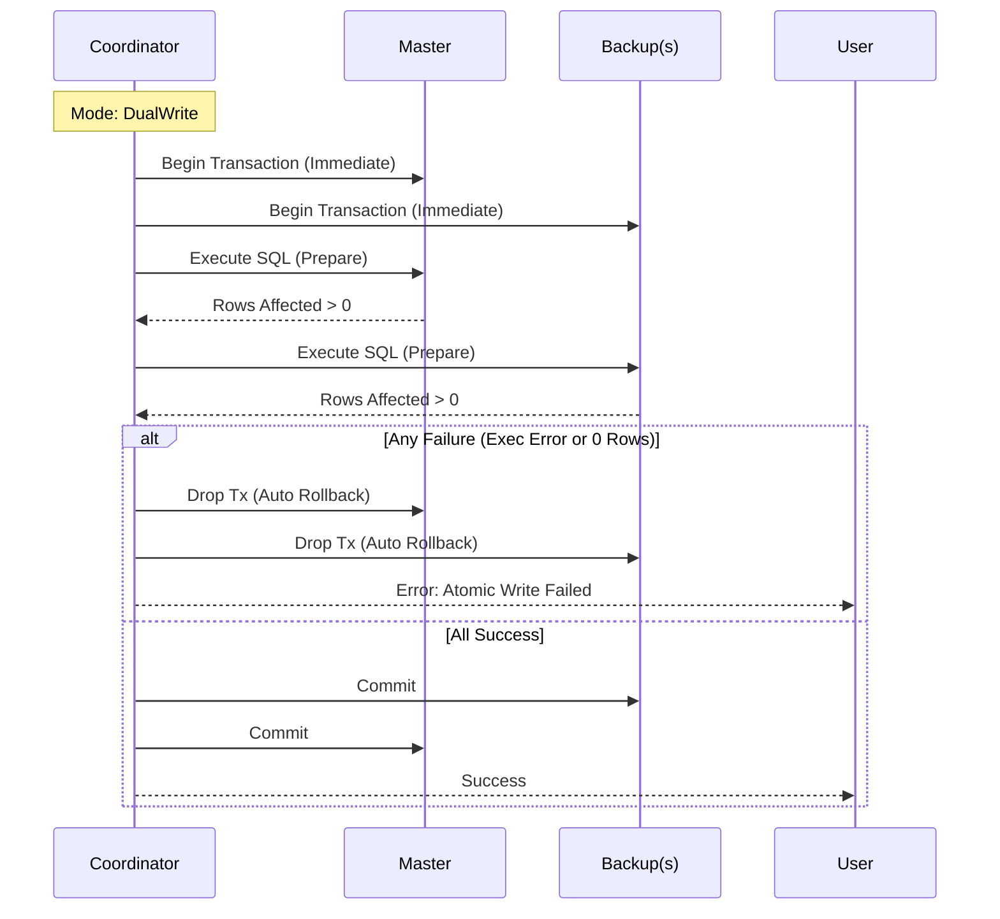
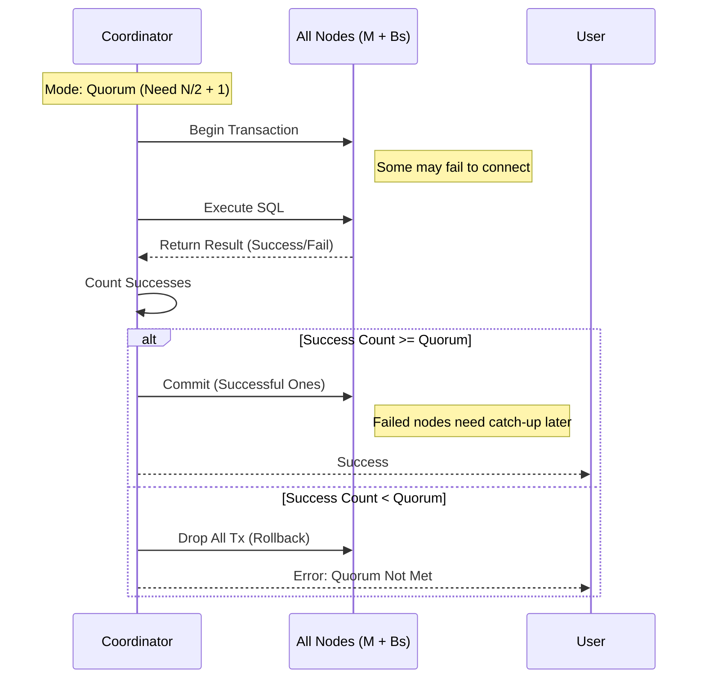

# SQLite Distributed Transaction & HA Cluster (Rust)

这是一个基于 Rust 和 SQLite 构建的轻量级分布式事务与高可用服务原型。它旨在解决多节点 SQLite 环境下的数据一致性问题，提供“全有或全无”（All-or-Nothing）的原子写入保证，并支持灵活的一致性策略切换。

## 核心特性 (Key Features)

*   **分布式原子写入 (2PC Variant)**: 采用两阶段提交（Two-Phase Commit）的变体，确保主库（Master）和备库（Backup）的数据变更要么全部提交，要么全部回滚。
*   **双模式一致性 (Dual Consistency Modes)**:
    *   **DualWrite (强同步)**: 适用于 2 节点（1主1备）。要求所有节点必须写入成功，追求绝对数据一致性。
    *   **Quorum (法定人数/HA)**: 适用于 3+ 节点。遵循“过半写成功即成功”原则，允许部分节点故障，提供更高可用性。
*   **乐观锁版本控制 (Optimistic Locking)**: 内置 `version` 字段管理，防止并发写入冲突，确保数据更新基于最新的状态。
*   **RAII 自动回滚**: 利用 Rust 的 `Drop` 特性，当事务协调器遇到错误或 Panic 时，持有的数据库事务句柄会自动销毁并触发 SQLite 的 `ROLLBACK`，天然防止数据不一致。
*   **集群元数据管理**: 每个节点维护 `_cluster_meta` 表，严格校验 Cluster ID 和节点角色，防止错误配置的节点加入集群。

## 架构方案 (Architecture)

### 1. 系统组件
*   **MultiDbCoordinator**: 核心协调器，负责连接所有节点，开启事务，分发 SQL，收集执行结果，并根据策略决定 Commit 或 Rollback。
*   **DbNode**: 数据库节点封装，负责连接管理、健康检查、元数据校验。
*   **ClusterConfig**: 定义集群拓扑（Master路径、Backup路径列表）及一致性模式。

### 2. 事务流程设计

#### 场景 A: DualWrite 模式 (强一致性)
适用于对数据准确性要求极高，且节点较少（如主备双机）的场景。



#### 场景 B: Quorum 模式 (高可用)
适用于 3 个及以上节点，需要容忍部分节点宕机的场景。



## 目录结构 (Directory Structure)

```text
.
├── Cargo.toml          # 项目依赖 (rusqlite, serde, anyhow, uuid)
├── DOC/
│   └── distributed_transaction_design.md # 详细设计文档
├── src/
│   ├── main.rs         # 入口程序：演示集群初始化、原子写入、一致性检查
│   ├── config.rs       # 配置定义 (ClusterConfig, ConsistencyMode)
│   ├── coordinator.rs  # 事务协调器 (实现 atomic_write 核心逻辑)
│   └── db_node.rs      # 节点抽象 (连接、健康检查、元数据)
└── data/               # 运行时生成的数据库文件 (自动创建)
```

## 快速开始 (Quick Start)

### 前置条件
*   安装 Rust (Cargo)

### 运行演示
演示程序会自动创建数据库，初始化集群，并执行模拟交易。

```bash
cargo run
```

### 切换模式
在 `src/main.rs` 中，你可以修改 `ConsistencyMode` 来体验不同的行为：

```rust
// src/main.rs

// 模式 1: 强一致性 (默认用于双节点)
let mode = ConsistencyMode::DualWrite;

// 模式 2: 高可用 (用于多节点)
// let mode = ConsistencyMode::Quorum;
```

## 数据源接入与主备一致性说明

### 1) 如何新增数据源（StorageEngine）
要接入新的数据源，需要实现 `StorageEngine` trait，并在服务端进行引擎选择注册：

1. **实现接口**：在 `src/engine/` 下新增实现，满足以下方法：
   - `execute`：执行普通 SQL（DDL/简单查询）
   - `prepare/commit/rollback`：两阶段提交的本地事务阶段
   - `get_version`：读取版本号（用于一致性校验）
   - `check_health`：健康检查
2. **注册引擎**：在 `src/bin/server.rs` 中将新引擎加入工厂选择逻辑。
3. **启动参数**：通过 `--engine` 与 `--db` 指定引擎类型与数据路径。

### 2) 主备一致性流程
主备一致性由协调器完成，核心流程如下：

1. **集群绑定**：每个节点初始化时写入 `_cluster_meta`，协调器会校验 `cluster_id` 与角色一致性。
2. **Prepare 阶段**：协调器对 Master 和所有 Backup 发起 `prepare`，并校验返回结果。
3. **Commit 阶段**：满足一致性策略（DualWrite/Quorum）后，先提交备库再提交主库。
4. **失败回滚**：任意节点失败会触发全量 `rollback`，保证原子性。

### 3) 表结构要求
主备一致性依赖版本控制，业务表必须包含 `version` 字段，并使用“条件更新”模式：

```sql
UPDATE business_data
SET content = ?, version = version + 1
WHERE id = ? AND version = ?;
```

## 待办与演进 (Roadmap)

1.  **自动选主 (Leader Election)**: 目前 Quorum 模式下仅做写入判断。下一步需要实现当 Master 宕机时，Coordinator 自动将拥有最新 `version` 的 Backup 提升为 Master。
2.  **脑裂防护 (Split-Brain Protection)**: 引入外部仲裁者（Arbiter）或文件锁机制。
3.  **节点追赶 (Catch-up)**: Quorum 模式下失败的节点在恢复后，需要从 Master 同步缺失的数据（基于 Version 或 WAL）。
