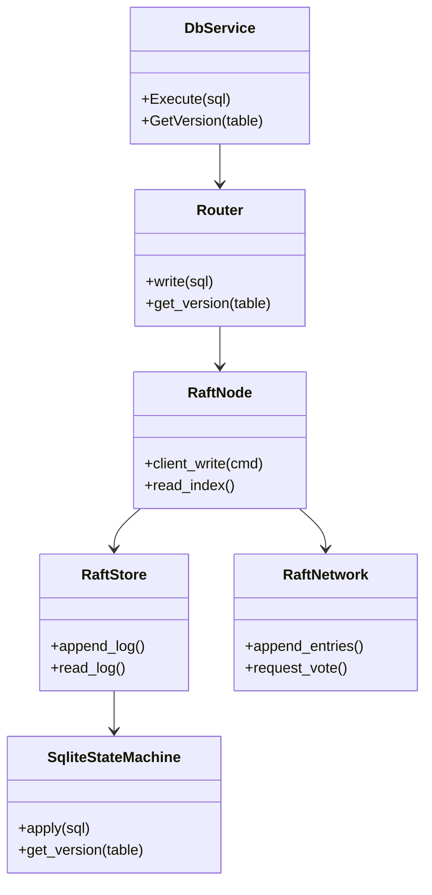
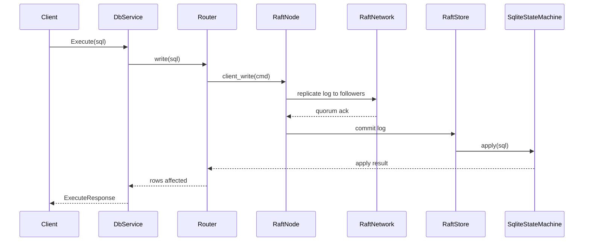
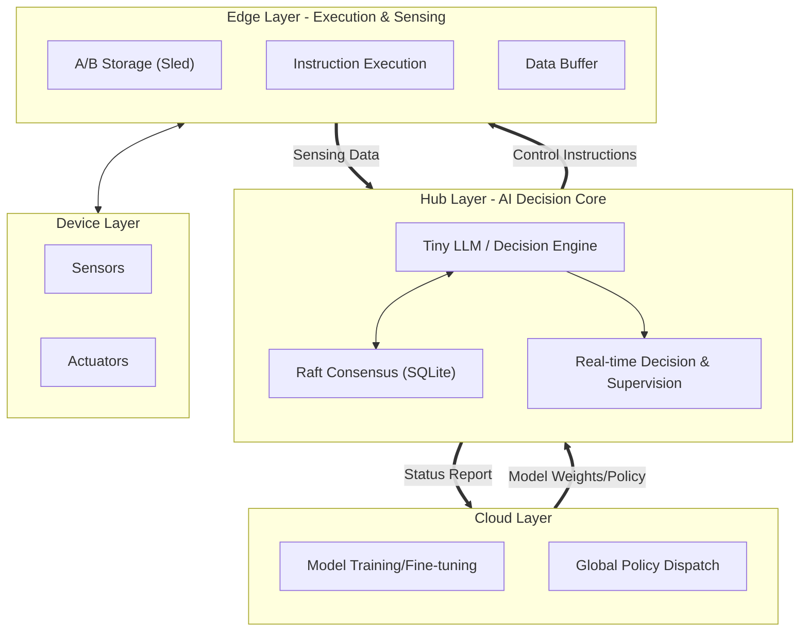

# Raft-based SQLite Distributed Cluster (Rust)

## Change Log
- **Reason**: Optimize Cloud-Edge-End architecture diagram to reflect Embedded AIoT Data Foundation (Tiny LLM + Real-time Decision).
- **Goal**: Align with the new vision of Hub as an AI decision core supervising Edge execution.
- **Time**: 2026-02-27
- **Reason**: Add cloud-edge-end architecture diagram and clarify status/verification commands.
- **Goal**: Keep README aligned with current topology and workflow.
- **Time**: 2026-02-26
- **Reason**: Align documentation with the Raft-based architecture and current CLI usage.
- **Goal**: Provide an English primary guide with required notes, usage, and diagrams.
- **Time**: 2026-02-18
- **Reason**: Add tested scenarios explanations and align with bilingual documentation split.
- **Goal**: Document verified behaviors without listing scenario names.
- **Time**: 2026-02-18

## Overview
This project implements a Raft-backed distributed SQLite cluster in Rust. Writes are replicated through a Raft log and applied to a SQLite state machine, while metadata and log persistence are stored in sled. The external gRPC API remains stable, but the internal write path is driven by Raft to ensure strong consistency.

## Key Features
- **Raft log replication** for consistent writes across nodes.
- **SQLite state machine** applies committed log entries.
- **sled persistence** for Raft log and metadata durability.
- **Linearizable read path** via leader read-index strategy (where available).
- **gRPC compatibility** with `Execute`, `GetVersion`, and health checks.
- **Scripted verification** with `verify.ps1` for fault scenarios.

## Current Implementation Status
- **Edge**: A/B slot switching with delayed cleanup, slot-scoped prefixing, configurable cleanup ratio.
- **Network**: gRPC + Protobuf transport in place; custom TCP framing and FlatBuffers are planned.
- **Hub**: Raft-based write path with SQLite state machine; smart batcher thresholds remain to be fixed.

## Architecture
### Components
- **Router**: Entry point for write/read requests in the server.
- **RaftNode**: Wraps Raft core and orchestrates log replication.
- **RaftStore**: Persists Raft log and metadata to sled.
- **SqliteStateMachine**: Applies committed SQL to SQLite.
- **RaftNetwork**: RPC adapter for Raft peer communication.
- **gRPC Service**: Exposes DatabaseService to clients.

## Class Diagram


## Sequence Diagram (Write Path)


## Cloud-Edge-End AIoT Architecture (Embedded Data Foundation)


## Roadmap

### 1. Infrastructure (Data Foundation)
- [ ] **Raft Network**: Migrate internal communication from in-memory (`RaftRouter`) to **gRPC** for real distributed deployment.
- [ ] **Linearizable Read**: Implement `ReadIndex` to ensure strong consistency when reading from Followers.
- [ ] **Storage Optimization**: Adapt Sled storage for **Vector Indexing** or **Time-series Data** to support efficient AI inference inputs.

### 2. AI Decision Core (Hub)
- [ ] **Model Management**: Implement mechanism to receive and hot-reload **Tiny LLM weights** from Cloud.
- [ ] **Embedded Inference**: Integrate `candle` or `ort` to run AI inference locally on Hub nodes.
- [ ] **Real-time Decision Loop**: Build `DecisionMaker` to listen to Raft state changes -> trigger inference -> generate control instructions.

### 3. Hub-Edge Supervision
- [ ] **Control Protocol**: Define standardized Hub -> Edge control instruction set (Protobuf).
- [ ] **Sensing Data Pipeline**: Implement high-frequency data reporting pipeline from Edge to Hub with buffering.
- [ ] **Execution Supervision**: Monitor Edge execution status (Ack/Result) and feed back to the decision engine for policy correction.

## Directory Structure
```text
.
├── Cargo.toml
├── DOC/
│   ├── distributed_transaction_design_EN.md # English architecture doc
│   └── distributed_transaction_design.md    # 中文架构文档
├── README_ZH.md                             # 中文 README
├── src/
│   ├── bin/
│   │   ├── server.rs                       # gRPC Server
│   │   └── client.rs                       # Scenario-driven Client
│   ├── engine/                             # Storage engine abstraction
│   ├── raft/                               # Raft core + state machine
│   ├── coordinator.rs                      # Client-side coordinator
│   └── config.rs
├── tests/                                  # Raft-focused integration tests
└── verify.ps1                              # Scenario verification script
```

## Quick Start
### Prerequisites
- Rust toolchain (cargo)

### Build
```bash
cargo build
```

### Start a 3-node cluster
```bash
cargo run --bin server -- --port 50051 --db master.db --engine sqlite
cargo run --bin server -- --port 50052 --db slave1.db --engine sqlite
cargo run --bin server -- --port 50053 --db slave2.db --engine sqlite
```

### Run the client scenario
```bash
cargo run --bin client -- --master-addr http://127.0.0.1:50051 --slave-addrs http://127.0.0.1:50052,http://127.0.0.1:50053 --mode quorum --scenario full
```

## Usage
### Server CLI
- `--port <u16>`: gRPC port to bind.
- `--db <path>`: SQLite database file path.
- `--engine <name>`: Storage engine (default: `sqlite`).

### Client CLI
- `--scenario <full|verify-only>`: Run full flow or verification only.
- `--mode <quorum|strong>`: Consistency mode.
- `--pause-before-commit-ms <ms>`: Inject pause window between prepare and commit.
- `--master-addr <url>`: Master node gRPC address.
- `--slave-addrs <url1,url2>`: Comma-separated slave node addresses.

### Verification Script
```powershell
./verify.ps1 -Scenario full
./verify.ps1 -Scenario restart_single_node
./verify.ps1 -Scenario prepare_commit_kill
```

### Development & Verification Commands
```bash
cargo fmt --all -- --check
cargo clippy --all-targets --all-features -- -D warnings
cargo test --test edge_ab
cargo test
cargo check
```

## Tested Scenarios / 已测试场景与情况
1) **Purpose / 用途**: Validate the full write/read flow with schema setup and consistency check.  
   **Key Checks / 关键检查点**: DDL execution, atomic writes, version increments, consistency verification across nodes.  
   **Expected Output / 输出预期**: Transactions commit successfully and all reachable nodes report the same version.

2) **Purpose / 用途**: Validate a single-node restart recovery with repeated consistency checks.  
   **Key Checks / 关键检查点**: Stop and restart one follower, re-run verify-only checks multiple times.  
   **Expected Output / 输出预期**: Consistency checks pass after restart without version rollback.

3) **Purpose / 用途**: Validate safety when a follower is killed during the pause window before commit.  
   **Key Checks / 关键检查点**: Inject pause, terminate one follower, restart and verify consistency.  
   **Expected Output / 输出预期**: Client completes, restarted node catches up, versions converge.

4) **Purpose / 用途**: Validate stability across multiple pause durations in the fault-injection flow.  
   **Key Checks / 关键检查点**: Iterate multiple pause values, repeat the kill-and-verify flow.  
   **Expected Output / 输出预期**: Each run completes with consistent versions across reachable nodes.

5) **Purpose / 用途**: Validate repeated verification after a full run without additional writes.  
   **Key Checks / 关键检查点**: Execute full flow once, then run verify-only multiple times.  
   **Expected Output / 输出预期**: Each verify-only run reports consistent versions.

## Required Notes
- **Consistency basis**: uses an internal write sequence; business tables do not need a `version` column.
- **Ports**: ensure 50051/50052/50053 (or custom) are available.
- **Data files**: SQLite files are created on demand; clean them between test runs if needed.
- **Pause window**: use `--pause-before-commit-ms` for fault-injection scenarios.
- **Leader availability**: writes fail when no Raft leader is elected.

## Next Steps
- Edge: finalize A/B cleanup thresholds and document operational guidance.
- Network: implement custom TCP framing and FlatBuffers serialization.
- Hub: solidify smart batcher thresholds with coverage tests.
- When 2PC supports multi-statement transactions, increment the sequence by statement count and add tests.
- Ensure ExecuteBatch does not increment the sequence on rollback, with success/failure tests.
- Keep non-leader get_version returning 0 without error and add coverage.
