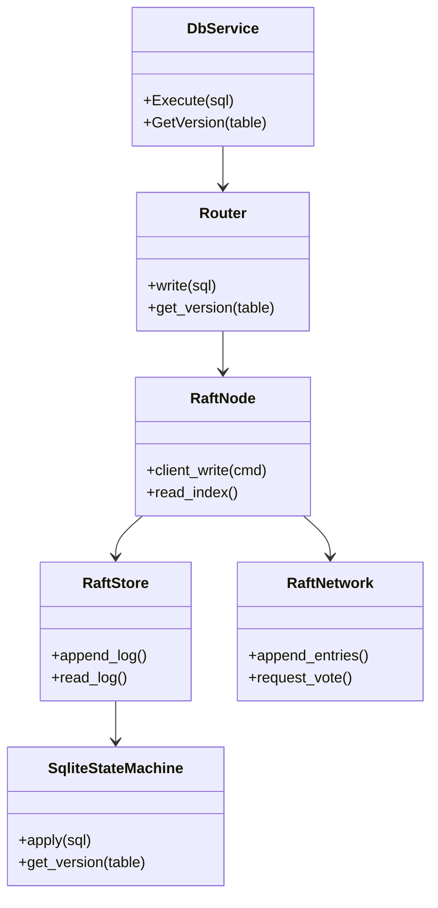
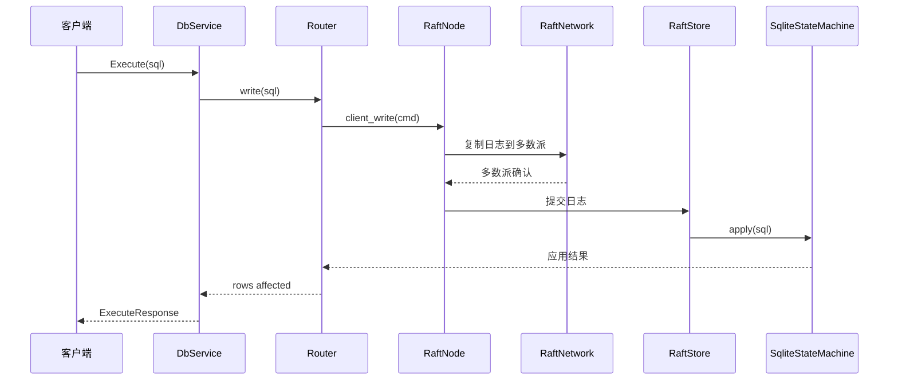
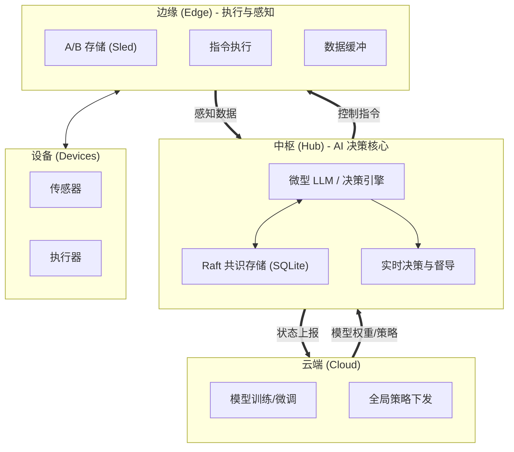

# 基于 Raft 的 SQLite 分布式集群（Rust）

## 修改记录
- **原因**：优化云-端-边架构图，体现嵌入式 AIoT 数据底座设计（微型 LLM + 实时决策）。
- **目的**：反映 Hub 作为 AI 决策核心、督导 Edge 执行的新架构愿景。
- **时间**：2026-02-27
- **原因**：补充云-端-边架构图并完善现状与验证命令说明。
- **目的**：保证 README 与当前拓扑和工作流一致。
- **时间**：2026-02-26
- **原因**：提供中文 README 并补充已测试场景说明。
- **目的**：与英文 README 保持结构一致，便于中文读者理解与验证。
- **时间**：2026-02-18

## 概述
本项目在 Rust 中实现了基于 Raft 的分布式 SQLite 集群。写入通过 Raft 日志复制并提交到 SQLite 状态机，元数据与日志持久化由 sled 提供。对外 gRPC 接口保持稳定，内部写路径由 Raft 驱动以确保强一致性。

## 核心特性
- **Raft 日志复制**：保证多节点写入一致性。
- **SQLite 状态机**：应用已提交日志到数据库。
- **sled 持久化**：存储 Raft 日志与元数据。
- **线性一致读路径**：通过 leader 的 read-index（如可用）。
- **gRPC 兼容**：保留 `Execute`、`GetVersion` 与健康检查。
- **脚本化验证**：使用 `verify.ps1` 覆盖故障场景。

## 当前实现状态
- **边**：A/B 槽位切换、延迟清理、槽位前缀隔离、清理阈值可配置。
- **端**：Raft 写入路径 + SQLite 状态机已就位，Smart Batcher 阈值待固化。
- **云**：管理与监控入口规划中，与端/边对接方式待细化。

## 架构
### 组件
- **Router**：服务端写/读请求入口。
- **RaftNode**：封装 Raft 核心并驱动日志复制。
- **RaftStore**：基于 sled 的日志与元数据存储。
- **SqliteStateMachine**：应用已提交 SQL。
- **RaftNetwork**：Raft 节点间 RPC 适配层。
- **gRPC Service**：对外 DatabaseService 接口。

## 类图


## 写入时序图


## 云-端-边 AIoT 架构图 (嵌入式数据底座)


## 下一步计划 (Roadmap)

### 1. 基础设施增强 (数据底座)
- [ ] **Raft 网络通信**：将内部通信从内存模拟 (`RaftRouter`) 迁移至 **gRPC**，支持真实分布式部署。
- [ ] **线性一致读**：实现 `ReadIndex` 机制，确保从 Follower 读取数据的一致性。
- [ ] **存储引擎适配**：优化 Sled 存储结构，以支持 **向量索引** 或 **时序数据**，为 AI 推理提供高效输入。

### 2. AI 决策中枢 (Hub)
- [ ] **模型管理与热更**：实现从云端接收并热更新 **微型 LLM 模型权重** 的机制。
- [ ] **嵌入式推理运行时**：集成 `candle` 或 `ort`，在 Hub 节点本地运行 AI 推理。
- [ ] **实时决策闭环**：构建 `DecisionMaker`，监听 Raft 状态机变更流 -> 触发推理 -> 生成控制指令。

### 3. 端边协同与督导 (Edge Supervision)
- [ ] **指令下发协议**：定义标准化的 Hub -> Edge 控制指令集 (Protobuf)。
- [ ] **感知数据上报**：实现 Edge -> Hub 的高频数据上报管道与缓冲策略。
- [ ] **执行督导**：监控 Edge 对指令的执行状态（Ack/Result），并反馈给决策引擎以修正策略。

## 目录结构
```text
.
├── Cargo.toml
├── DOC/
│   ├── distributed_transaction_design_EN.md # English architecture doc
│   └── distributed_transaction_design.md    # 中文架构文档
├── README.md                                # English README
├── README_ZH.md                             # 中文 README
├── src/
│   ├── bin/
│   │   ├── server.rs                       # gRPC 服务端
│   │   └── client.rs                       # 场景驱动客户端
│   ├── engine/                             # 存储引擎抽象
│   ├── raft/                               # Raft 核心 + 状态机
│   ├── coordinator.rs                      # 客户端协调器
│   └── config.rs
├── tests/                                  # Raft 集成测试
└── verify.ps1                              # 场景验证脚本
```

## 快速开始
### 前置条件
- Rust 工具链（cargo）

### 构建
```bash
cargo build
```

### 启动 3 节点集群
```bash
cargo run --bin server -- --port 50051 --db master.db --engine sqlite
cargo run --bin server -- --port 50052 --db slave1.db --engine sqlite
cargo run --bin server -- --port 50053 --db slave2.db --engine sqlite
```

### 运行客户端场景
```bash
cargo run --bin client -- --master-addr http://127.0.0.1:50051 --slave-addrs http://127.0.0.1:50052,http://127.0.0.1:50053 --mode quorum --scenario full
```

## 使用说明
### Server CLI
- `--port <u16>`：gRPC 监听端口。
- `--db <path>`：SQLite 数据文件路径。
- `--engine <name>`：存储引擎（默认 `sqlite`）。

### Client CLI
- `--scenario <full|verify-only>`：执行完整流程或仅一致性校验。
- `--mode <quorum|strong>`：一致性模式（客户端侧协调逻辑）。
- `--pause-before-commit-ms <ms>`：在 prepare/commit 间注入停顿。
- `--master-addr <url>`：主节点地址。
- `--slave-addrs <url1,url2>`：备节点地址（逗号分隔）。

### 验证脚本
```powershell
./verify.ps1 -Scenario full
./verify.ps1 -Scenario restart_single_node
./verify.ps1 -Scenario prepare_commit_kill
```

### 开发与验证命令
```bash
cargo fmt --all -- --check
cargo clippy --all-targets --all-features -- -D warnings
cargo test --test edge_ab
cargo test
cargo check
```

## Tested Scenarios / 已测试场景与情况
1) **用途**：验证从建表到写入再到一致性校验的完整流程。  
   **关键检查点**：DDL 执行、原子写入、版本递增、跨节点一致性校验。  
   **输出预期**：事务成功提交，所有可达节点版本一致。

2) **用途**：验证单节点重启后的恢复与一致性。  
   **关键检查点**：停止并重启一个备节点，多次执行仅校验流程。  
   **输出预期**：重启后一致性校验通过，无版本回退。

3) **用途**：验证提交前暂停窗口内故障注入的安全性。  
   **关键检查点**：触发暂停、终止一个备节点、重启后一致性校验。  
   **输出预期**：客户端流程结束，重启节点追齐后版本一致。

4) **用途**：验证多种暂停时长下的稳定性。  
   **关键检查点**：遍历多个暂停值，重复故障注入与一致性校验。  
   **输出预期**：每次运行均完成且可达节点版本一致。

5) **用途**：验证一次完整流程后的重复一致性校验。  
   **关键检查点**：先执行完整流程，再多次执行仅校验流程。  
   **输出预期**：每次仅校验均返回一致版本。

## 必备说明
- **一致性依据**：使用内部写入序号，不要求业务表包含 `version` 字段。
- **端口与文件**：确保端口空闲，SQLite 文件按需创建。
- **故障注入**：使用 `--pause-before-commit-ms` 控制故障窗口。
- **Leader 依赖**：无 Leader 时写入会失败，需等待选主完成。

## 下一步规划
- 边：完善 A/B 清理阈值策略并补充运维指引。
- 端：固化 Smart Batcher 阈值并增加覆盖测试。
- 云：明确配置/监控对接流程与数据面接口。
- 2PC 提交支持多语句时，序号按语句数递增并增加对应测试。
- ExecuteBatch 发生失败回滚时序号不递增，并补充失败与成功路径测试。
- 非 Leader 的 get_version 保持返回 0 且不报错，增加覆盖测试。
