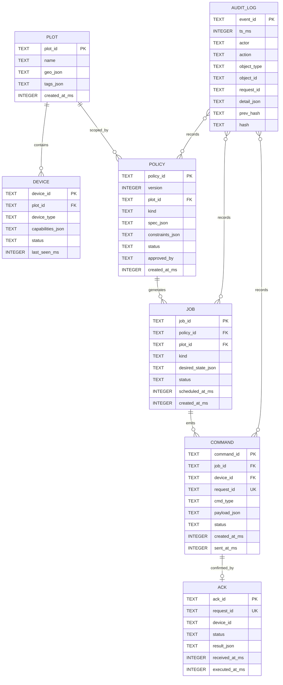
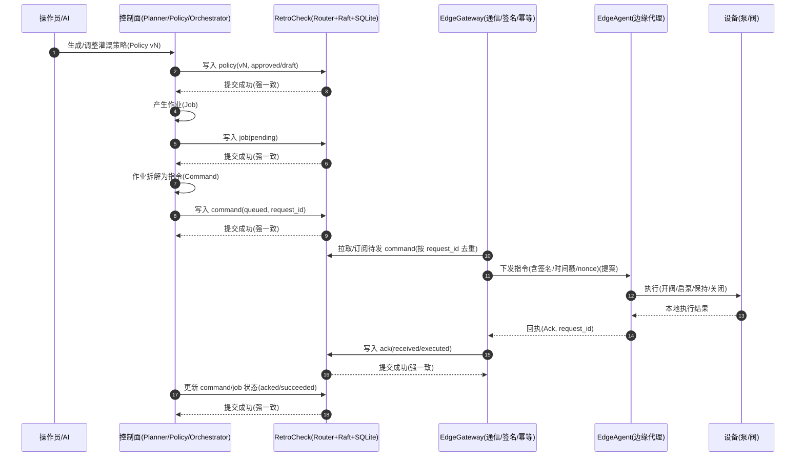
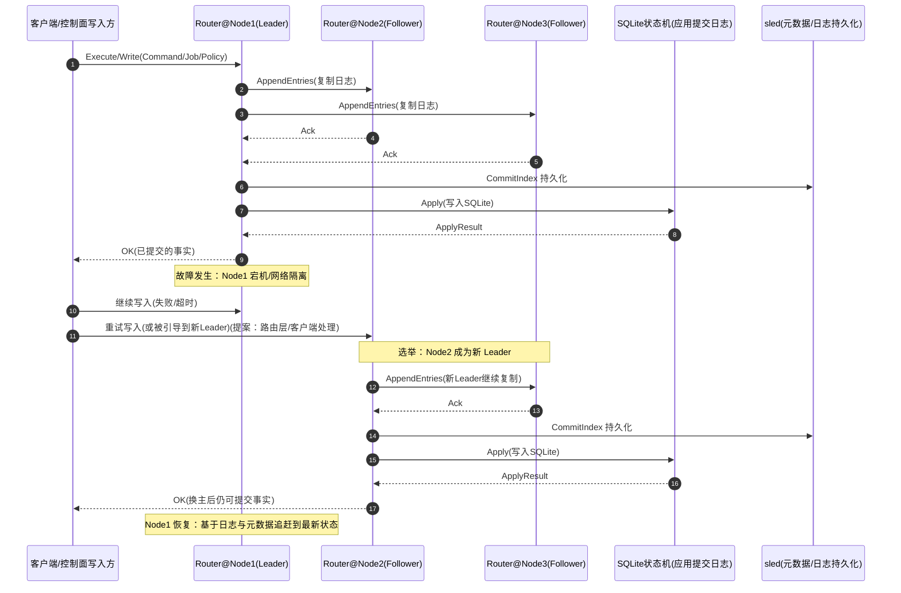

# RetroCheck 宣发附录（草案）：最小数据模型与故障窗口时序

## 0. 声明（请务必保留）

- 本文以“农场灌溉作业”作为 **类比场景**，用于解释 RetroCheck 这类数据底座在 AIoT 控制系统中的价值与形态。
- 我们 **没有进入真实农场做端到端验证**；文中业务流程、作业拆分、字段设计属于“工程可行的最小模型提案”，需要农业专家与现场工程团队进一步校验与补全。
- RetroCheck 在仓库 `D:\Rust\check_program\` 的现状：核心能力是 **Raft 复制写入 + SQLite 状态机应用 + sled 元数据/日志持久化**，并在测试中覆盖 failover/压测场景；对外“农场业务域模型”尚未落地到具体表结构与 API。

> ### 记忆点（2026-03-08）
> 宣发文章必须以 RetroCheck（本仓库数据底座）为主角，所有叙事与图示都要能映射到已有代码能力或明确标注为“待验证提案”，避免给读者造成“已量产落地”的误解。

---

## 1. RetroCheck 在体系中的位置（不依赖农场假设）

RetroCheck 可以被看作 Hub 层的数据事实底座，专门解决三件事：

1. **把“写入事实”变成强一致**：写请求以 Raft 日志形式复制到多数派后再提交。
2. **把“事实状态”变成可查询**：提交后的日志被应用到 SQLite 状态机，形成结构化状态。
3. **把“故障恢复”变成可回放**：sled 持久化 Raft 元数据/日志，使节点重启、换主后可恢复一致状态。

仓库中的对应组件（名称来自 README 的组件图）：

- Router：写/读入口（负责把写请求交给 Raft）
- RaftNode：Raft 核心包装与复制协同
- RaftStore：sled 持久化 Raft 日志与元数据
- SqliteStateMachine：提交日志的 apply 落库与查询

---

## 2. “灌溉作业”最小数据模型（提案）

### 2.1 设计目标（最小但闭环）

- **可治理**：策略（Policy）可版本化、可审批、可回滚。
- **可编排**：作业（Job）可拆为多条设备指令（Command），有状态与重试。
- **可对账**：回执（Ack）与指令通过 `request_id` 关联，重复发送不重复执行。
- **可审计**：关键变更写入审计日志（Audit），便于复盘与追责。

> 说明：下面表结构是为了“让读者一眼理解 RetroCheck 解决什么”，不是当前仓库已实现的业务表。

### 2.2 ER 图（读者优先）



### 2.3 SQLite DDL（可复制执行的版本）

```sql
-- plot：地块/区域资源（最小建模）
CREATE TABLE IF NOT EXISTS plot (
  plot_id TEXT PRIMARY KEY,
  name TEXT NOT NULL,
  geo_json TEXT NOT NULL,      -- GeoJSON / 简化多边形等（提案）
  tags_json TEXT NOT NULL,     -- 自定义标签（提案）
  created_at_ms INTEGER NOT NULL
);

-- device：设备资源目录（与 plot 关联）
CREATE TABLE IF NOT EXISTS device (
  device_id TEXT PRIMARY KEY,
  plot_id TEXT NOT NULL,
  device_type TEXT NOT NULL,        -- pump/valve/sensor/cam 等（提案枚举）
  capabilities_json TEXT NOT NULL,  -- 能力与约束：最大流量/互斥关系/协议（提案）
  status TEXT NOT NULL,             -- online/offline/maintenance（提案）
  last_seen_ms INTEGER NOT NULL,
  FOREIGN KEY(plot_id) REFERENCES plot(plot_id)
);

-- policy：策略（可审批/可版本）
CREATE TABLE IF NOT EXISTS policy (
  policy_id TEXT NOT NULL,
  version INTEGER NOT NULL,
  plot_id TEXT NOT NULL,
  kind TEXT NOT NULL,               -- irrigation / pest_scan / fertilize 等（提案）
  spec_json TEXT NOT NULL,          -- 业务策略：阈值/目标/预算（提案）
  constraints_json TEXT NOT NULL,   -- 安全护栏：互锁/上限/时间窗（提案）
  status TEXT NOT NULL,             -- draft/approved/disabled（提案）
  approved_by TEXT NOT NULL,
  created_at_ms INTEGER NOT NULL,
  PRIMARY KEY(policy_id, version),
  FOREIGN KEY(plot_id) REFERENCES plot(plot_id)
);

-- job：一次作业实例（由策略触发/生成）
CREATE TABLE IF NOT EXISTS job (
  job_id TEXT PRIMARY KEY,
  policy_id TEXT NOT NULL,
  policy_version INTEGER NOT NULL,
  plot_id TEXT NOT NULL,
  kind TEXT NOT NULL,
  desired_state_json TEXT NOT NULL, -- 例如：目标湿度区间/用水量预算（提案）
  status TEXT NOT NULL,             -- pending/running/succeeded/failed/canceled（提案）
  scheduled_at_ms INTEGER NOT NULL,
  created_at_ms INTEGER NOT NULL,
  FOREIGN KEY(plot_id) REFERENCES plot(plot_id),
  FOREIGN KEY(policy_id, policy_version) REFERENCES policy(policy_id, version)
);

-- command：面向设备的指令（request_id 用于端到端幂等与对账）
CREATE TABLE IF NOT EXISTS command (
  command_id TEXT PRIMARY KEY,
  job_id TEXT NOT NULL,
  device_id TEXT NOT NULL,
  request_id TEXT NOT NULL UNIQUE,  -- 端到端幂等键：重复发送不重复执行（提案）
  cmd_type TEXT NOT NULL,           -- open_valve/start_pump/stop_pump/...（提案）
  payload_json TEXT NOT NULL,       -- 参数：时长/目标流量/阈值（提案）
  status TEXT NOT NULL,             -- queued/sent/acked/timeout/failed（提案）
  created_at_ms INTEGER NOT NULL,
  sent_at_ms INTEGER NOT NULL,
  FOREIGN KEY(job_id) REFERENCES job(job_id),
  FOREIGN KEY(device_id) REFERENCES device(device_id)
);

-- ack：设备回执（与 command 通过 request_id 关联）
CREATE TABLE IF NOT EXISTS ack (
  ack_id TEXT PRIMARY KEY,
  request_id TEXT NOT NULL UNIQUE,
  device_id TEXT NOT NULL,
  status TEXT NOT NULL,             -- received/executed/rejected（提案）
  result_json TEXT NOT NULL,        -- 执行结果：错误码/测量快照（提案）
  received_at_ms INTEGER NOT NULL,
  executed_at_ms INTEGER NOT NULL
);

-- audit_log：审计事件（可选做哈希链，用于不可抵赖性；提案）
CREATE TABLE IF NOT EXISTS audit_log (
  event_id TEXT PRIMARY KEY,
  ts_ms INTEGER NOT NULL,
  actor TEXT NOT NULL,              -- operator/ai/planner/system
  action TEXT NOT NULL,             -- create_policy/approve_policy/emit_command/...
  object_type TEXT NOT NULL,        -- policy/job/command
  object_id TEXT NOT NULL,
  request_id TEXT NOT NULL,
  detail_json TEXT NOT NULL,
  prev_hash TEXT NOT NULL,
  hash TEXT NOT NULL
);
```

---

## 3. 流程图：策略落库 → 编排下发 → 回执闭环（提案）

> 读者视角：这张图的重点不是“灌溉细节”，而是解释 RetroCheck 如何在 Hub 侧提供强一致事实底座，让控制面可治理。



这张图可以直接映射 RetroCheck 的“强一致事实链”能力：

- 任何“策略/作业/指令/回执”的状态变更，都必须写入 RetroCheck 才算系统认可的事实。
- `request_id` 作为幂等与对账主键，使得弱网重试不会引入重复执行（前提：边缘侧同样按 request_id 做幂等）。
- EdgeGateway/EdgeAgent 的具体协议与签名细节可以迭代，但“事实底座”的一致性语义不应改变。

---

## 4. 流程图：故障窗口下为什么 RetroCheck 能“抗住换主”

> 读者视角：在主节点故障（10~30 秒）期间，系统不靠“运气”维持正确性，而是靠 Raft 提供的提交语义与换主后继续写入的能力。



读者要点：

- RetroCheck 的“正确性”来自 **提交语义**：只有多数派确认、并进入提交索引的写入，才是系统事实。
- 换主并不会让事实丢失：新 Leader 继续复制并提交，SQLite 状态机在新 Leader 上继续 apply。
- 故障恢复后，旧节点通过日志追赶回到一致状态（具体实现细节由 RaftStore/sled 与日志复制承担）。

---

## 5. 待验证清单（需要现场与专家补齐）

- [ ] 农业域模型校验：地块/作物阶段/水肥策略字段是否覆盖实际作业需要。
- [ ] 安全护栏落地：互锁、上限、双人审批、紧急停止等在边缘侧的最小实现。
- [ ] 端到端幂等：设备侧是否能以 `request_id` 做去重与重放保护（弱网/断电场景）。
- [ ] 回执可信度：回执签名、时钟漂移、nonce 管理与重放攻击防护。
- [ ] 性能与SLO：在 10~30 秒换主窗口内，允许的退化范围（成功率/时延/丢包）。
- [ ] 可观测性：指标、链路追踪、审计事件的采集与关联方式。

